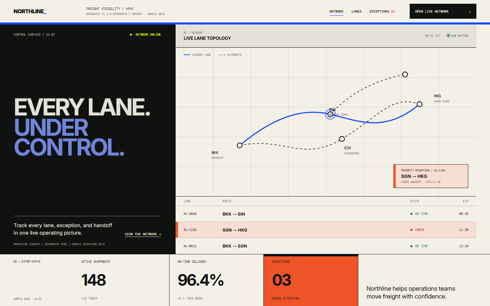

<p align="center">
  
</p>

# Gridgeist

**English** · [ภาษาไทย](README.th.md) · [Fork repository](https://github.com/devmonstr/gridgeist) · [Upstream website](https://ohmiler.github.io/gridgeist/) · [Examples](https://ohmiler.github.io/gridgeist/examples/)

Gridgeist is an agent skill for creating, redesigning, and reviewing product-native web interfaces. It adapts structure, typography, imagery, interaction, and product evidence to the established brand, using grids as visible, quiet, or invisible logic. It helps agents move beyond generic AI-generated SaaS patterns while preserving product intent, behavior, responsiveness, and accessibility.

## Maintained fork

This repository is a maintained fork by [devmonstr](https://github.com/devmonstr),
built on the original [Gridgeist](https://github.com/ohmiler/gridgeist) project by
[Miler](https://github.com/ohmiler). The upstream authorship, MIT license, release
history, and original case-study evidence remain credited and intact.

This fork develops Gridgeist further without presenting that upstream work as new
authorship. Its current direction focuses on proportional typography, tighter skill
trigger boundaries, bilingual behavioral coverage, and rendered evidence for public
UI changes. See [NOTICE.md](NOTICE.md) for the concise provenance record.

| Stewardship | Reference |
| --- | --- |
| Fork maintainer | [devmonstr](https://github.com/devmonstr) |
| Original author | [Miler / ohmiler](https://github.com/ohmiler) |
| Upstream source | [ohmiler/gridgeist](https://github.com/ohmiler/gridgeist) |
| Maintained fork | [devmonstr/gridgeist](https://github.com/devmonstr/gridgeist) |
| License | [MIT](LICENSE), with the upstream copyright notice preserved |

### Use the current fork

Install the current fork directly with the Agent Skills CLI:

```powershell
npx skills add devmonstr/gridgeist -g
```

Or clone it when you want to inspect, modify, or validate the complete repository:

```powershell
git clone https://github.com/devmonstr/gridgeist.git
```

The fork is preparing **v1.3.0-devmonstr.1**, based on upstream v1.2.0. The
universal installer uses the current fork directly. The Codex marketplace entry
becomes installable when the matching fork tag is published; until then, use the
universal or manual path below.

## See the difference

This maintained-fork comparison uses the Northline fixture inherited from upstream
v1.2.0 so the product, copy, sample data, and viewport remain comparable. The After
page now reflects the fork's **v1.3.0-devmonstr.1** direction: proportional display
type, more useful product context above the fold, and the same evidence-led system
workflow. Northline and all displayed data are fictional.

<table>
  <tr>
    <th width='50%'>Without Gridgeist - generic SaaS</th>
    <th width='50%'>With the devmonstr fork - proportional system</th>
  </tr>
  <tr>
    <td></td>
    <td></td>
  </tr>
</table>

Same content and sample operating data; a more proportional hierarchy. The fork
keeps topology, route table, exception, actions, and metrics connected while
reducing headline dominance so operational context remains visible. Both README
images are browser captures of pages stored in this repository. Inspect the
[showcase source](site/readme-showcase/index.html), or compare this fork with the
[upstream v1.2.0 baseline](https://github.com/ohmiler/gridgeist/tree/v1.2.0).

## What the devmonstr fork changes

The fork retains the upstream system-contract workflow and adds tighter constraints
where the original direction could overuse display scale or blur skill ownership.

| Area | v1.3.0-devmonstr.1 behavior |
| --- | --- |
| Proportional hierarchy | Sizes display, page, section, and component headings from role, content, language, measure, and viewport—not impact alone. |
| Useful context | Keeps product material or the primary task visible around large headings instead of letting a title consume the screen. |
| Trigger precision | Invokes Gridgeist when product or visual direction is genuinely in scope, without turning narrow behavioral fixes into redesigns. |
| Bilingual stress | Adds paired English and Thai evaluation coverage for oversized-title correction while preserving the established identity. |
| System continuity | Retains upstream semantic roles, component grammar, direction alignment, state coverage, and evidence boundaries. |
| Verification | Adds proportional-type diagnostics to responsive, overflow, focus, interaction, theme, and reduced-motion review. |

The fork changes are validated locally across 11 routes and four viewport sizes
(44 route/viewport checks), with zero unintended overflow, console warnings, or
headings exceeding the recorded viewport threshold. Upstream v1.2.0 evaluation
history remains available as inherited evidence; the new Scenario 20 is added but
has not yet been run in isolated agent sessions.

## 60-second Quickstart

1. Install Gridgeist through the primary channel for your agent.

   For the current fork, use the universal installer:

   ```powershell
   npx skills add devmonstr/gridgeist -g
   ```

   After the `v1.3.0-devmonstr.1` tag is published, Codex can use the fork's Git marketplace:

   ```powershell
   codex plugin marketplace add devmonstr/gridgeist
   codex plugin add gridgeist@gridgeist
   ```

   **Manual fallback:** If neither installer is available, continue to [Manual installation](#manual-installation).
2. Start a new agent session in your web project and paste:

   ```text
   Use the Gridgeist skill to review this interface without editing it yet. Give me a one-line verdict, prioritized findings with evidence, and one coherent redesign direction. Preserve the product's behavior and brand.
   ```

Agents that support explicit skill invocation can use `$gridgeist` in the prompt. Continue to [Installation](#installation) for product-specific details and more examples.

## Use cases

- Create a distinctive landing page, dashboard, documentation site, portfolio, or learning platform.
- Redesign an existing interface without breaking its behavior or brand.
- Review a draft and prioritize hierarchy, composition, responsiveness, accessibility, and implementation quality.
- Adapt technical, editorial, image-led, playful, utilitarian, or visible-grid direction without erasing the brand.

## Installation

### Codex plugin

This repository is packaged as a Codex plugin through [`.codex-plugin/plugin.json`](.codex-plugin/plugin.json). The plugin points to the same `skills/gridgeist/` directory used by the other channels, so all installations share one source of truth.

After the `v1.3.0-devmonstr.1` tag is published, add the fork marketplace and
install the plugin:

```powershell
codex plugin marketplace add devmonstr/gridgeist
codex plugin add gridgeist@gridgeist
```

Start a new Codex session after installation so the bundled skill is discovered.

### Universal installer

For Claude Code, Cursor, Gemini CLI, GitHub Copilot, OpenCode, and other compatible agents, install Gridgeist with the [open agent skills CLI](https://github.com/vercel-labs/skills):

```powershell
npx skills add devmonstr/gridgeist -g
```

The installer discovers `skills/gridgeist/` and prompts you to choose the target agents. To select one directly, pass its agent name; for example:

```powershell
npx skills add devmonstr/gridgeist -g -a claude-code
```

### Manual installation

Use manual copying only when the plugin and universal installer are unavailable:

```powershell
git clone https://github.com/devmonstr/gridgeist.git
Copy-Item -Recurse .\gridgeist\skills\gridgeist "$HOME\.agents\skills\gridgeist"
```

For a different agent, copy `skills/gridgeist/` to that product's skills directory. The agent must support the Agent Skills `SKILL.md` convention. Discovery and invocation behavior can differ between products. Start a new agent session after copying the directory.

## Updating

Gridgeist releases do not update silently. Use the command for the channel that installed the skill, then start a new agent session.

### Codex plugin

Refresh the Git-backed marketplace snapshot, then reinstall the plugin version exposed by that release:

```powershell
codex plugin marketplace upgrade gridgeist
codex plugin add gridgeist@gridgeist
```

Confirm the installed version with `codex plugin list`. If the current session still uses older instructions, start a new thread or restart the Codex app.

### Universal installer

Update a global Gridgeist installation:

```powershell
npx skills update gridgeist -g -y
```

For a project-scoped installation, use `npx skills update gridgeist -p -y` instead.

### Git clone or manual copy

Run `git pull --ff-only` in an existing clone, then reinstall from `skills/gridgeist/`. Manual copies do not retain source or version metadata, so replace the complete skill directory from a tagged release. Prefer the Codex plugin or universal installer when future updates matter.

## Example prompts

Invoke Gridgeist directly with `$gridgeist` and include four essentials:

1. The product and its audience.
2. The mode: create, redesign, or review.
3. What must be preserved, such as behavior, brand color, or content.
4. What must be verified, such as desktop, mobile, keyboard, and accessibility.

```text
Use $gridgeist to redesign this Next.js course landing page. Preserve all behavior and the blue brand color, but replace the generic SaaS cards with an editorial grid and verify desktop and mobile layouts.
```

```text
Review this dashboard with $gridgeist. Give me a one-line verdict, prioritized findings with evidence, and a coherent replacement direction before editing.
```

```text
Use $gridgeist to create a technical documentation homepage where real API examples and navigation structure carry the visual identity.
```

### Brief for a closer match

For a more precise result, provide these details when they are relevant:

- **Product and audience** — what the product does and who uses it.
- **Primary task** — the most important thing the user must accomplish.
- **Direction** — the intended character, such as warm editorial, precise
  technical, or playful tactile.
- **Authentic material** — product UI, data, prose, imagery, artwork, code, or a
  workflow that should carry visual weight.
- **Preserved constraints** — brand signals, content, routes, behavior, components,
  privacy, or platform requirements that must not change.
- **Exclusions** — visual language or behavior that would be wrong for the product.
- **Flows and states** — the important default, loading, empty, error, success,
  disabled, and destructive paths.
- **Verification** — representative viewports, keyboard, touch, focus, overflow,
  reduced motion, and primary flows to exercise.

When the direction is already clear, state it and let Gridgeist proceed without
another aesthetic questionnaire. When several materially different directions are
still credible, ask Gridgeist to inspect first, offer two or three grounded options
with trade-offs and a recommendation, and wait for alignment before editing.

Copy and adapt this template:

```text
Use $gridgeist to [create / redesign / review] [page or product surface].

Product and audience:
[What it does and who uses it]

Primary task:
[The most important user outcome]

Direction:
[A confirmed direction, or: Inspect first, propose two or three grounded
directions with trade-offs and a recommendation, and do not edit until I choose.]

Authentic material that should lead:
[Product UI / data / prose / imagery / artwork / code / workflow]

Preserve:
[Brand, content, routes, behavior, components, and constraints]

Avoid:
[Visual language or behavior that would be wrong]

Important flows and states:
[Primary flow and applicable default/loading/empty/error/success/disabled states]

Verify:
[Viewports, keyboard, touch, focus, overflow, reduced motion, and primary flow]

Inspect the repository and rendered interface before taking action.
```

Describe outcomes and genuine constraints rather than prescribing a CSS recipe.
Unless they are established brand requirements, leave font sizes, spacing, radii,
shadows, and column counts for Gridgeist to derive as one coherent system.
Gridgeist treats monumental display type as an earned exception: page titles should
remain proportional to their role, content, language, viewport, and the product
material or primary task that must stay visible around them.

If a project already contains a `DESIGN.md`, theme, token set, or component
library, Gridgeist inspects it alongside the implementation and rendered interface
instead of assuming the sources agree. `DESIGN.md` is optional interoperability,
not a dependency: Gridgeist should not create or update one unless you request a
portable design-system artifact or explicitly include durable system documentation
in the work.

Gridgeist also allows implicit invocation when the agent recognizes that visual or
product direction is genuinely in scope for a web-interface task; narrow behavioral
fixes that preserve the current UI should not trigger a redesign workflow.

## Working with companion skills

Gridgeist works best as the sole owner of product and visual direction, with optional companion skills supplying context, technical review, or rendered evidence. The lightest recommended workflow for most projects is:

```text
Gridgeist -> Playwright
```

Gridgeist defines the interface thesis, hierarchy, system, and implementation direction. Playwright then checks the rendered result across representative viewports and interactions; it can also provide repeatable [visual comparisons](https://playwright.dev/docs/test-snapshots).

| Situation | Recommended workflow | Division of responsibility |
| --- | --- | --- |
| Most web projects | `Gridgeist -> Playwright` | Design and implementation, then rendered verification |
| Figma is the source of truth | `Figma -> Gridgeist -> Playwright` | Extract components, variables, and layout context; adapt them to the product and codebase; verify the result. See the [Figma MCP server](https://developers.figma.com/docs/figma-mcp-server/). |
| React or Next.js | `Gridgeist -> Vercel React Best Practices -> Playwright` | Own the interface direction; review framework performance; verify behavior. See [Vercel Agent Skills](https://github.com/vercel-labs/agent-skills). |
| Pre-release quality audit | `Gridgeist -> Web Quality Audit -> Playwright` | Review hierarchy and brand fit; audit accessibility, performance, SEO, and web quality; confirm the live result. See [Web Quality Skills](https://github.com/addyosmani/web-quality-skills). |
| Original imagery is required | `Gridgeist -> image generation -> Gridgeist -> Playwright` | Establish the thesis before generating assets, compose with the selected assets, then verify the interface. |

Treat these as optional workflows, not dependencies. Add only the companion that answers a real need, and keep another broad frontend-design or art-direction skill out of the same design phase; competing visual priors can weaken a coherent result. Companion skill names and availability vary between agents.

Example:

```text
Use $gridgeist to redesign this interface while preserving its behavior and brand.
After implementation, use Playwright to verify representative desktop and mobile
viewports, keyboard interaction, overflow, and the primary user flow.
```

## Repository layout

```text
.codex-plugin/
  plugin.json          Codex plugin manifest
skills/gridgeist/      Installable skill
  SKILL.md             Trigger conditions and core workflow
  agents/openai.yaml   Agent-facing interface metadata
  references/          Design language and review checklist
evals/prompts.md       Repeatable manual behavior checks
docs/                  Design and implementation records
```

## Upstream case studies

The following case studies were created by Miler/ohmiler for the original project.
They are retained here as upstream evidence, not presented as work created by this
fork. Fork-specific evidence lives under [`.solodeveling/evidence/`](.solodeveling/evidence/).

[Tracefield](https://ohmiler.github.io/tracefield/) applies Gridgeist to a working developer-observability dashboard. Its [repository](https://github.com/ohmiler/tracefield) preserves the generic baseline, exact prompt, evaluation rubric, tested trace domain, and responsive final interface.

[Ledgerline](https://ohmiler.github.io/ledgerline/) tests the same skill on dense payment API documentation. Its [repository](https://github.com/ohmiler/ledgerline) preserves a conventional baseline, exact prompt, six-part rubric, deterministic API content, four viewport checks, and the responsive final interface.

[Morrow](https://ohmiler.github.io/morrow-portfolio/) stress-tests brand adaptation with a fictional image-led creative portfolio. Its [repository](https://github.com/ohmiler/morrow-portfolio) preserves shared AI-generated artwork, a conventional baseline, exact prompts, a six-part rubric, four viewport checks, and a final interface deliberately unlike the technical case studies.

[Doodlewood](https://ohmiler.github.io/doodlewood/) tests playful interaction design with a fictional, privacy-preserving children's drawing studio. Its [repository](https://github.com/ohmiler/doodlewood) preserves the generic baseline, exact prompt, six-part rubric, local drawing engine, four viewport checks, and explicit limits around child safety and real-user evidence.

Together, these four upstream studies cover data-heavy, content-heavy, image-led,
and playful interactive surfaces. The fork's next validation step is independent
cross-domain testing of its proportional hierarchy changes.

## Limitations

- Output quality depends on the agent inspecting the actual repository and rendered interface.
- Automated checks do not replace visual inspection at representative viewport sizes.
- The suggested defaults are starting points, not a mandatory preset for every brand.
- Model outputs are not deterministic. Re-run evaluations when the skill or target agent changes.

## Validation

Validate the installable skill structure:

```powershell
python -X utf8 "$HOME\.codex\skills\.system\skill-creator\scripts\quick_validate.py" .\skills\gridgeist
```

Check release metadata and bilingual documentation without external dependencies:

```powershell
python -X utf8 .\scripts\validate_release.py
```

Exercise clean installation and updates through the live Codex marketplace and universal installer. This check requires Codex, Node.js, npm, Git, and network access; it uses temporary homes and does not modify your existing installations.

```powershell
python -X utf8 .\scripts\smoke_test_install.py
```

Behavioral evaluation prompts are in [`evals/prompts.md`](evals/prompts.md).

## Contributing

Fork-specific issues and pull requests are welcome at
[devmonstr/gridgeist](https://github.com/devmonstr/gridgeist). Keep `SKILL.md`
concise and place detailed, conditionally loaded guidance in `references/`. For
behavior changes, update an evaluation scenario and record what failed before
changing the skill. Changes intended for the original project should be proposed to
[upstream](https://github.com/ohmiler/gridgeist) separately.

## License

[MIT](LICENSE). The original copyright notice remains with Miler; fork-specific
modifications are maintained by devmonstr under the same license. See
[NOTICE.md](NOTICE.md).
